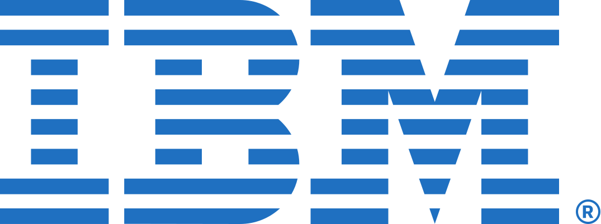
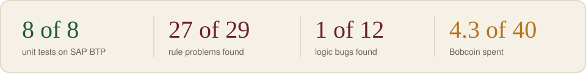
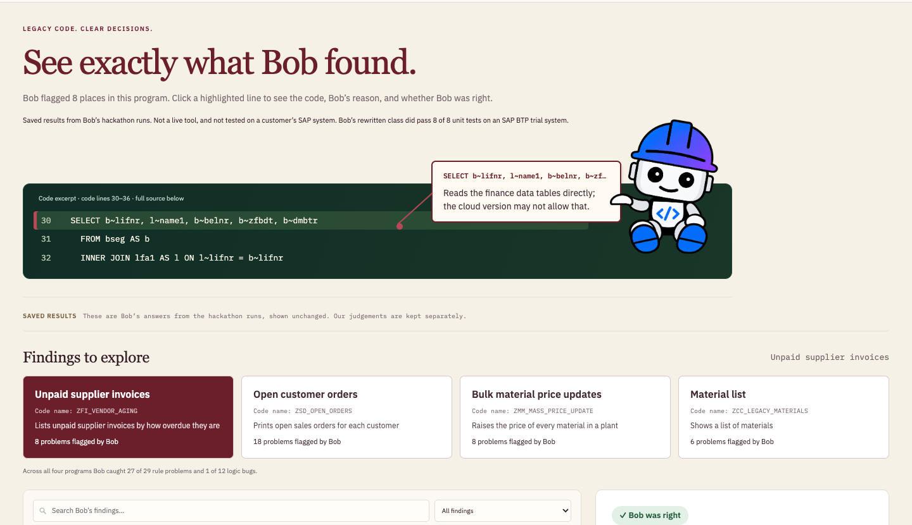
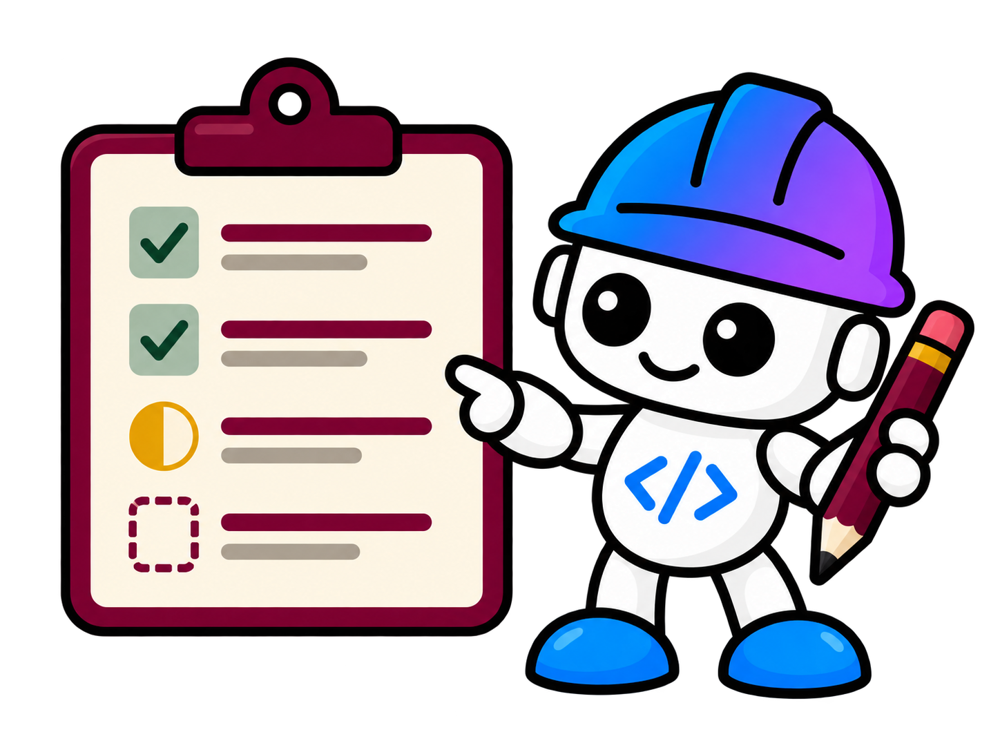

<p align="center">
  
  &nbsp;&nbsp;&nbsp;
  
</p>
<p align="center"><sub>Built with IBM Bob for the IBM Bob 2.0 Hackathon</sub></p>

<h1 align="center">Clean Core Copilot</h1>

<p align="center"><b>An IBM Bob mode that reviews old SAP code for the cloud, and knows what it must not claim.</b></p>

<p align="center">
  <a href="https://clean-core-copilot.vercel.app"></a>
</p>

<p align="center">
  
</p>

**SAP ends mainstream maintenance for ECC 6.0 on 31 December 2027. Every
custom Z program needs a Clean Core review before it can move. Clean Core
Copilot lets IBM Bob do the first pass, and measures how far to trust it.**
Built with IBM Bob for the IBM Bob 2.0 Hackathon (lablab.ai, Sep 2026).

Evidence: [scoring](docs/scoring/) · [SAP trial record](docs/activation/) · [Bob sessions](bob_sessions/) · [verification notes](docs/verification-notes.md). The site shows recorded evidence, not a live analyzer.

<p align="center"><a href="https://clean-core-copilot.vercel.app"></a></p>

## The problem


Companies moving to S/4HANA Cloud carry thousands of custom Z programs written
over 15+ years. Each one has to be checked against Clean Core rules: which
tables it reads directly, which screens it replays, which files it writes.
Today that review is manual, slow, and done by the few people who know both
the old and the new world.

## What it does


A Bob custom mode, **Clean Core Architect**, that:

1. **Audits** a legacy ABAP program line by line against a fixed rule
   catalogue ([`docs/clean-core-rules.md`](docs/clean-core-rules.md)). Every
   finding cites a rule ID, the line, and the released alternative.
2. **Marks what is verified and what isn't** — every finding carries a
   `verification_status`; without a known target release the overall status
   is *Needs target verification*, with Ready / Refactor / Rebuild only as a
   planning hint.
3. **Modernizes** on approval: CDS view entities over released views, RAP/EML
   for writes, and ABAP Unit tests that pin the legacy business rules.
4. **Lists what a human must still decide** — it does not pretend to know
   what it can't verify.

## Try it on your own code


Clean Core Copilot is a Bob mode, so it runs wherever Bob runs. Ten minutes:

1. Copy [`bob-config-draft/clean-core-architect.mode.md`](bob-config-draft/clean-core-architect.mode.md) into a Bob custom mode (role definition, when-to-use, custom instructions), and put [`docs/clean-core-rules.md`](docs/clean-core-rules.md), [`docs/verification-rules.md`](docs/verification-rules.md) and [`docs/findings.schema.json`](docs/findings.schema.json) into your workspace under `docs/`. Grant the mode Read and Edit only.
2. Open your legacy `.abap` file, select the mode, and send one prompt: *"Audit this program against the catalogue and write `reports/<program>.json` and `.md`."* Bob cites one rule ID per finding and lists what it could not verify.
3. Ask Bob to modernize it. It drafts a CDS view, a class and ABAP Unit tests, marking every unverified object name `candidate`.
4. Open the [demo site](https://clean-core-copilot.vercel.app), go to **Proof**, and upload the JSON to browse the findings on your code and record your own verdicts. Nothing leaves your browser.
5. Activate, run ATC and the tests on **your** SAP release. The mode never claims that step happened; only your system can.

The exam numbers in this repository describe our four sample programs, not your code.

## How Bob is used


Everything Bob did happened in IBM Bob 2.2.0 (enterprise plan, hackathon
account) between 25 Sep 20:10 and 26 Sep 16:28 TRT. One screenshot per task
with the consumption badge is in [`bob_sessions/`](bob_sessions/).
Three files there are **not Bob sessions but test evidence**: `2026-09-26_abap_unit_7_tests.png`,
`2026-09-27_equivalence_8_tests.png` and `2026-09-27_planted_bug_caught.png` are
ABAP Unit results from the BTP trial system in VS Code.

**Custom mode.** Bob's Settings → Modes → *Create new mode* form was used to
define **Clean Core Architect** (slug `clean-core-architect`, global scope).
Role, "when to use" and the nine custom instructions were typed from the
pre-event draft in [`bob-config-draft/`](bob-config-draft/); the wording is
the same, the wrapper is Bob's. Tools enabled for tasks 1–6: **Read** and
**Edit** only — no Execute, Browser, MCP, Subagent or Todo. That was
deliberate: the audit should be reproducible from reading, and nothing
should reach a system. For task 7, **Subagent** and **Todo** were added
(26 Sep 16:08, `docs/journal.md`); Execute, Browser and MCP stayed off.

**Workspace isolation.** Bob never opened this repository. It worked in
`~/Desktop/ccc-bob-audit`, built by
[`scripts/make-audit-workspace.sh`](scripts/make-audit-workspace.sh) from the
frozen inputs only (samples, rule catalogue, verification rules, schema,
mode draft). No `.git`, no plan, no answer key. The script refuses to build
if the inputs don't match the committed `docs/freeze.sha256`.

**Tasks.** Seven tasks, all in the custom mode, one prompt each. Tasks 1–6:
every file write approved by hand. Task 7: sub-agent spawns and file writes
approved for the task as a whole, files reviewed afterwards:

| # | Task | Prompt | Output | Bobcoin |
|---|------|--------|--------|---------|
| 1 | Audit ZFI_VENDOR_AGING | [`bob-config-draft/first-task.md`](bob-config-draft/first-task.md) with output paths spelled out | `reports/zfi_vendor_aging.{json,md}` | 0.165 |
| 2 | Audit ZSD_OPEN_ORDERS | same template | `reports/zsd_open_orders.*` | 0.155 |
| 3 | Audit ZMM_MASS_PRICE_UPDATE | same template | `reports/zmm_mass_price_update.*` | 0.187 |
| 4 | Audit ZCC_LEGACY_MATERIALS | same template | `reports/zcc_legacy_materials.*` | 0.154 |
| 5 | Modernize ZFI_VENDOR_AGING | audit JSON named as approved input; CDS + class + ABAP Unit + README requested | `modernized/zfi_vendor_aging/` | 0.807 |
| 6 | Fix review findings R3, R1 | the review's wording, one consistent naming approach requested | four diffs in `modernized/zfi_vendor_aging/` | 1.03 |
| 7 | Modernize ZSD, ZMM, ZCC **in parallel** | one prompt: one sub-agent per program, same recipe as ZFI, R3 lesson stated | 13 files in `modernized/`, `PARALLEL_RUN.md` | 1.76 |

Total **4.258 of 40 Bobcoin (≈4.3; 10.6% of the allowance)** across seven tasks. The first six
tasks used **2.498 Bobcoin (≈2.5)**; task 7 added 1.76. These are recorded
Bob usage figures, not the total project cost: human work, Claude and Codex
usage, and target-system checks are outside this budget. Different programs
and approval workflows were involved, so these runs do not establish a
cost or speed improvement from parallel execution.

### What did 4.258 Bobcoin actually buy?


Think of it as asking an assistant to inspect four old business programs,
prepare replacement drafts for all four, and revise one after review.
The four synthetic examples cover supplier payments, open sales orders,
material price updates and a material list — no customer code was used.

| Work completed with Bob | In everyday language | Bobcoin |
|-------------------------|----------------------|---------|
| Review four programs | Bob pointed to 40 places worth checking and explained its concerns. Against our pre-written answer key, it found 27 of the 29 main issues. The 40 findings include repeats and mistakes; they are not 40 confirmed defects. | 0.661 |
| Draft a replacement for one program | For the supplier-payment ageing report, Bob wrote a new data-access definition, the calculation class, seven automated test cases, and an explanation of the changes and remaining decisions. | 0.807 |
| Revise the draft after review | Bob aligned the field names across the files and added a document-item identifier to distinguish items within a document. These changes were reviewed by reading the code. | 1.030 |
| Draft replacements for the other three programs in parallel | Three Bob sub-agents each prepared a replacement draft, tests and explanatory notes; together with a shared summary, this produced 13 files. These remain candidates requiring review and target-system checks. | 1.760 |
| **All seven tasks** | **Four reviews, four replacement drafts with tests, and one revision round for ZFI.** | **4.258** |

The earlier **2.498** figure covered tasks 1–6 only; it is a historical
subtotal, not the current total. All seven tasks used about **10.6% of the
40-Bobcoin allowance**. The practical output is
a reviewable starting point for a developer: where to look, what might replace
the old code, and what still needs checking. It is **not a completed cloud
migration**. Test code was written (including seven tests for ZFI); this
budget summary does not claim that the tests passed or that the replacements
run on the target system.
See the current [activation record](docs/activation/README.md) for execution
results. Human scoring was performed by Claude and confirmed by Sena;
the demo interface was built with Codex, not with these Bobcoins.

The quality figures describe these four prepared samples, not general SAP
accuracy. Only 1 of 12 additional issues was found; among 32 findings with a
scoring decision, 29 were correct (six duplicates and two unscored
observations excluded). [Scoring details](docs/scoring/zcc_legacy_materials.md).

**Architecture lesson:** define a bounded task, give it the relevant rules,
review the output, request specific corrections, and track cost alongside
quality. This demonstrates budget-aware development; proving cost
optimization would require a like-for-like comparison, which we have not
performed yet.

**What Bob's features did and didn't do here.**
- *Document understanding:* each task started with Bob reading the catalogue,
  the verification rules and the JSON schema, then the sample. The reports
  cite rule IDs from the catalogue only — the mode's "never invent a rule ID"
  instruction held in all 40 findings, though two stretched a rule
  (`docs/scoring/`).
- *Agent mode with approvals:* Bob proposed each write; 18 approvals were
  given (two per audit, six in task 5, four in task 6), none rejected. In task 5 Bob noticed that its test class called a
  method that did not exist, added `FRIENDS` and a wrapper, and applied the
  fix as two diffs before finishing — a self-correction the screenshot in
  `bob_sessions/2026-09-25_task5_*.png` records.
- *Sub-agents (parallel):* used in task 7. The mode's tool list was
  changed on 26 Sep 16:08 to add **Subagent** and **Todo** (still no
  Execute, Browser or MCP); Bob then modernized three programs at once, one
  sub-agent each, 16 minutes, 1.76 Bobcoin. The four audits had run one
  after another on purpose, so that each consumption figure and screenshot
  belongs to one program. Review: `docs/scoring/parallel_modernization.md`.
- *Execute / MCP:* **not used.** Bob never compiled, activated or ran
  anything. Every "verified" field in its output is `observed` or
  `needs_verification`; `verified_on_target` never appears.

**What was not Bob.** The rule catalogue, samples, answer key and demo page
were prepared before the kick-off (see "Prepared before the hackathon" below). The scoring in
`docs/scoring/` was done by Claude Code, reading Bob's JSON against the
answer key; the demo page was built by Codex. Sena directed both, made the
disclosure and mascot decisions, and approved each Bob write.

## Results


<!-- Measured, not claimed: findings scored by Claude, judgements confirmed by Sena. -->

| Program | Findings | Correct | Wrong | Missed | Verdict hint |
|---------|----------|---------|-------|--------|--------------|
| ZSD_OPEN_ORDERS | 18 (5 duplicates) | 11 core | 1 (F-11) | 1 core + 3 bonus | Rebuild (key says Refactor) — see [`docs/scoring/zsd_open_orders.md`](docs/scoring/zsd_open_orders.md) |
| ZFI_VENDOR_AGING | 8 | 6 core + 1 bonus | 0 (1 partially correct) | 4 bonus | Rebuild — see [`docs/scoring/zfi_vendor_aging.md`](docs/scoring/zfi_vendor_aging.md) |
| ZMM_MASS_PRICE_UPDATE | 8 | 6 core | 1 (F-07) | 3 bonus | Rebuild — see [`docs/scoring/zmm_mass_price_update.md`](docs/scoring/zmm_mass_price_update.md) |
| ZCC_LEGACY_MATERIALS | 6 (1 duplicate) | 4 core + 1 extra | 0 | 1 core (runtime) + 1 bonus | Rebuild (key says Refactor) — see [`docs/scoring/zcc_legacy_materials.md`](docs/scoring/zcc_legacy_materials.md) |

Totals across the four audits: core recall 27 / 29, bonus 1 / 12, 40 raw
findings of which 6 are duplicates, precision over decided findings 29 / 32,
0.66 Bobcoin. All judgements confirmed by Sena on 26 Sep; two Bob findings
that match the key's own "human must decide" notes are recorded but scored
neither way (`docs/scoring/zcc_legacy_materials.md`, totals).

**Modernization (ZFI_VENDOR_AGING, task 5):** CDS view entity, class, ABAP
Unit tests and per-finding README in
[`modernized/zfi_vendor_aging/`](modernized/zfi_vendor_aging/), 0.807
Bobcoin. Reviewed by reading only — see
[`docs/scoring/zfi_vendor_aging_modernization.md`](docs/scoring/zfi_vendor_aging_modernization.md):
verification discipline intact, one probable activation error (CDS element
names vs. class field names), one data-model gap (no item number in the
key), one legacy bug carried over. A follow-up task (26 Sep, 1.03 Bobcoin)
fixed the first two by reading; the legacy bug is left as is.

**Activation on a BTP ABAP Environment trial (26 Sep):** the CDS view
did not activate — its two consumed views, `I_OperationalAcctgDocItem` and
`I_Supplier`, do not exist on the trial system (exactly the two Bob had
marked *candidate*). To test the class anyway, two labelled stub tables and
a stub version of the view were added (not Bob output, see
[`docs/activation/stubs/`](docs/activation/stubs/)). Against them the
class activated, **all seven ABAP Unit tests passed**, and ATC reported
0 errors / 2 warnings on class + view. Getting there exposed two syntax
defects in Bob's rewrite that only a compiler finds: `FRIENDS` on a
`PUBLIC` class (must be `LOCAL FRIENDS` in the test include) and five uses
of the old `sy-datum` variant, both flagged by ABAP for Cloud Development.
An earlier "class activated, ATC 0" result had been withdrawn because the
pasted object was still an empty skeleton. Full log in
[`docs/activation/README.md`](docs/activation/README.md). The trial is not
the customer's target release and the read side ran against a stub, so
the status stays *Needs target verification*.

## Honest limits


- **Synthetic samples.** The four programs and the 41 planted problems were written by us; customer ABAP cannot be published. Every number on this page describes this test, not Bob in general.
- **The answer key is the sample author's.** It is sealed by hash, but it is not an independent review. Two of Bob's findings matched the key's own "human decision" notes and were left unscored rather than counted either way.
- **One program was tested, against stubs.** ZFI's class compiled and its tests passed on a free BTP trial with two labelled stand-in tables. Bob's own view did not activate there. Nothing ran against real finance data or on a customer's release.
- **Three rewrites are unreviewed.** Task 7 produced 13 files in parallel; nobody has read or run them.
- **No like-for-like speed claim.** 16 minutes (three programs, parallel) versus 45 minutes (one program, serial) are different jobs. We report both and claim no ratio.
- **No customer validation.** The problem statement comes from the S/4HANA Clean Core migration practice, not from a customer interview run for this hackathon.
- **Mascot permission pending.** IBM Bob artwork is shown under the hackathon disclosure; a `SHOW_MASCOT` flag turns it off if IBM objects.

## Prepared before the hackathon


The kick-off was 25 September 2026, 18:00 TRT (15:00 UTC). The organisers
confirmed that pre-prepared synthetic sample code and demo UI templates may be
used *"as long as they are clearly disclosed in your repository and all the
core Bob analysis and project logic are built during the hackathon"* (Hamza,
lablab.ai — `#participants-chat-ibm-bob-2-0-hackathon`, 25 Sep 2026, 19:37 TRT).

Everything below existed before the kick-off. Commit dates are in the git
history.

| What | Where | Prepared | Notes |
|------|-------|----------|-------|
| Four synthetic legacy Z programs | `samples/legacy/` | 24 Sep | Written for this demo, no customer code. Audit input, never edited. |
| Clean Core rule catalogue | `docs/clean-core-rules.md` | 24 Sep | CC-01 … CC-12, the fixed rules Bob audits against. |
| Verification rules and findings schema | `docs/verification-rules.md`, `docs/findings.schema.json` | 24 Sep | Output format Bob has to follow. |
| Draft of the custom mode and first task | `bob-config-draft/` | 24 Sep | Written without Bob 2.0 access. To be moved into Bob's real mode format during the hackathon; any change to the wording is visible in the git history. |
| Answer key (baseline) | kept outside the repo | 24 Sep | The issues planted in the samples, written by the sample author, not an independent review. Only its SHA-256 is published, in `docs/freeze.sha256`, so it can't be changed after Bob's results are seen. |
| Freeze and audit-workspace scripts | `scripts/` | 24 Sep | Bob runs on an isolated copy with no plan, notes or answer key. |
| Demo UI (findings viewer, case viewer) | `demo-prototype/` | 24–25 Sep | Built with Codex. Shows recorded output only; contains no Bob results. |
| Plan, presentation outline, verification notes | `docs/` | 24 Sep | Working notes. |

The frozen inputs (`docs/freeze.sha256`, 24 Sep 16:37 UTC) cover the samples,
rules, schema, mode draft and baseline.

**Built during the hackathon:** the Bob custom mode in its final form, every
Bob audit and modernization run, `reports/`, `modernized/`, `bob_sessions/`,
the measured results table, and the demo content that shows them.

**Mascot:** the demo shows IBM's Bob artwork (`demo-prototype/assets/ibm-bob.webp`,
from bob.ibm.com, unchanged, IBM's property). Permission to use it was asked
of IBM through the organisers on 25 Sep 2026 (Discord, Hamza / lablab.ai,
reminder 26 Sep); no answer had arrived when the static image was enabled on
26 Sep. The animated greeting stays disabled. If IBM objects, the image is
removed with one flag (`SHOW_MASCOT` in `demo-prototype/demo-config.js`).

## Repo layout

```
samples/legacy/   synthetic legacy Z programs (the input, never edited)
docs/             rule catalogue, verification notes, findings schema, plan
reports/          Bob's audit output (JSON per docs/findings.schema.json + MD)
modernized/       Bob's cloud-ready rewrite
bob_sessions/     exported Bob task reports (required for judging)
```

The legacy samples are synthetic, written for this demo. No customer code.

## Demo page



The demo URL renders the recorded `reports/*.json` files: Bob's output plus
the human review columns. It is an evidence page, not a live analyzer —
re-running the audit happens in Bob.

## Author

Sena Köse — Software Engineering student.

## License

MIT — see [LICENSE](LICENSE). The IBM Bob artwork in `demo-prototype/assets/` is IBM's and is used under the hackathon disclosure noted in the README; it is not covered by this license.

<sub>IBM Bob artwork © IBM, shown under the hackathon's disclosure rule; our own illustrations of Bob are derived from it and flagged as such in <code>demo-prototype/assets/</code>.</sub>
